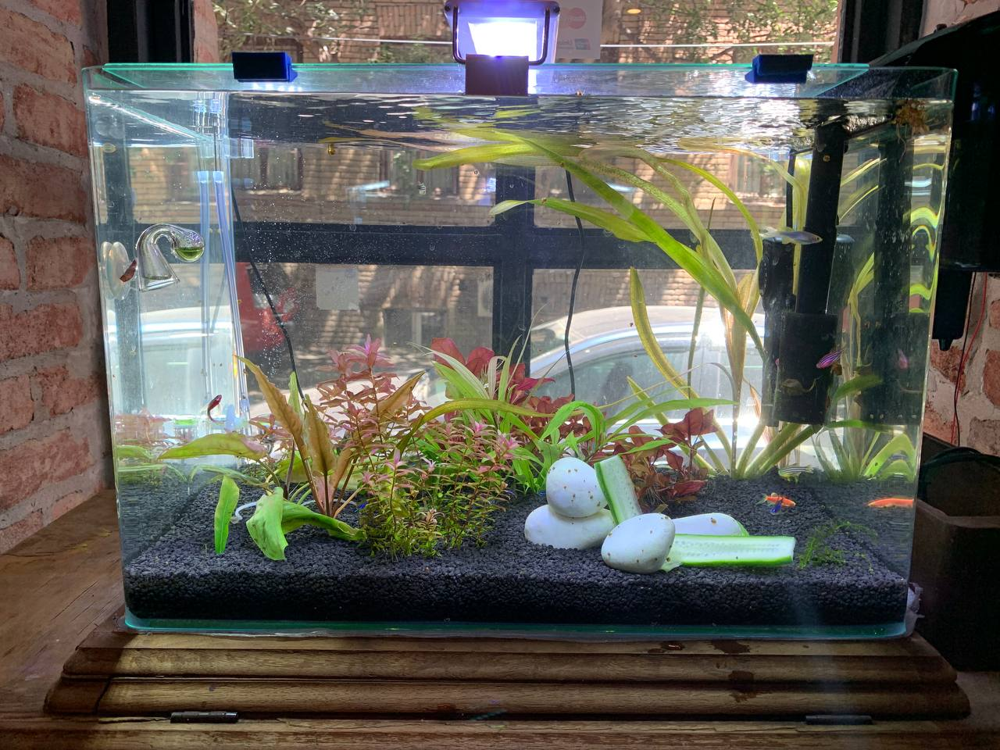
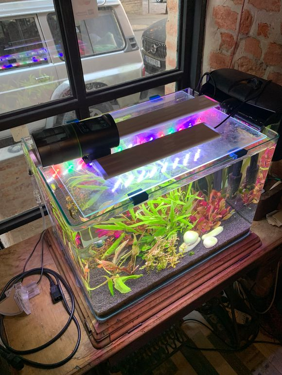

# Aquarium

Owner: [@lalala454](https://t.me/lalala454)
Topic: [Private](https://t.me/c/1900643629/1731)

## Summary

This project is no longer active in the space.

The aquarium was removed after the fish died because of a gas-related mistake.

Historically, this was a freshwater aquarium near the entrance. It used:

- automatic feeding at 12:00 and 20:00 every day;
- a plant light timer from 17:00 to 23:00;
- a large sponge filter;
- thermostat-controlled water temperature;
- carbon dioxide supply for plant growth.

The maintenance topic remains useful as historical context, but this page should not be read as "there is currently a working aquarium in F0".

## Gallery

## Video

First edition
https://t.me/f0rthsp4ce_l1ve/113 

Fishes glow in UV light
https://t.me/f0rthsp4ce_l1ve/227

## Maintenance (RU)

https://balanced-coffee-160.notion.site/59e328c140b04e92b5e84fdf3075ef14?pvs=4

## Links

1. https://blog.tetra.net/ru/ru/gollandskij-akvarium-podvodnye-sady
2. https://www.manua.ls/rev/25300/manual
