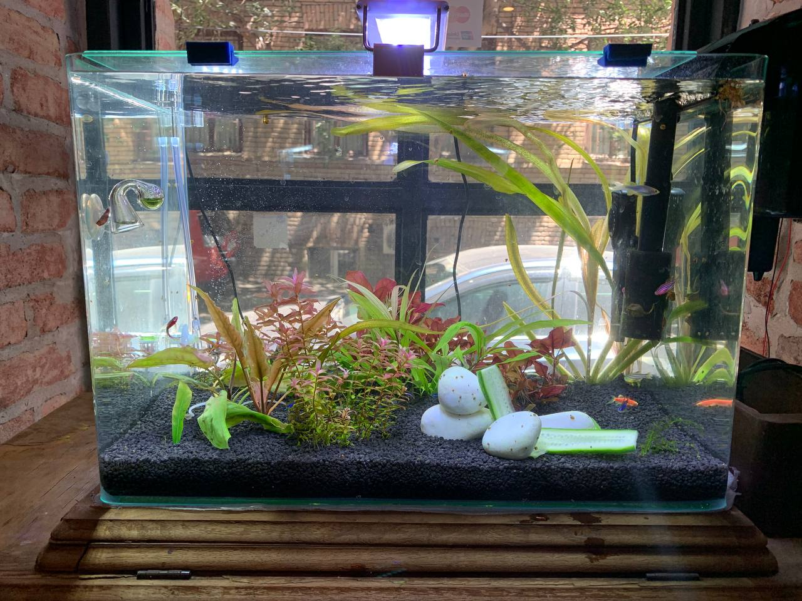
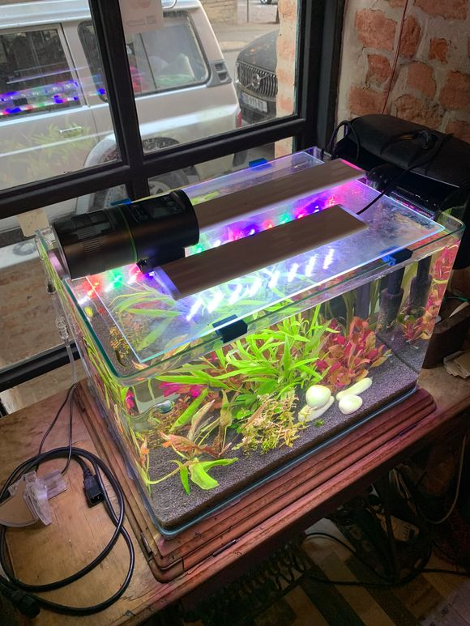

# Aquarium

Owner: [@lalala454](https://t.me/lalala454)
Topic: [Private](https://t.me/c/1900643629/1731)

## Summary

A freshwater aquarium stands at the entrance to the hackerspace and delights visitors.
The fish are fed automatically at 12:00 and 20:00 every day.
The plant light operates on a timer from 17:00 to 23:00.
To prevent the fish from dying, the water is filtered through a large filter with a sponge.
The water temperature is maintained by a thermostat.
Carbon dioxide is supplied to the aquarium to accelerate plant growth.

## Gallery

## Video

First edition
https://t.me/f0rthsp4ce_l1ve/113 

Fishes glow in UV light
https://t.me/f0rthsp4ce_l1ve/227

## Maintenance (RU)

https://balanced-coffee-160.notion.site/59e328c140b04e92b5e84fdf3075ef14?pvs=4

## Links

1. https://blog.tetra.net/ru/ru/gollandskij-akvarium-podvodnye-sady
2. https://www.manua.ls/rev/25300/manual
