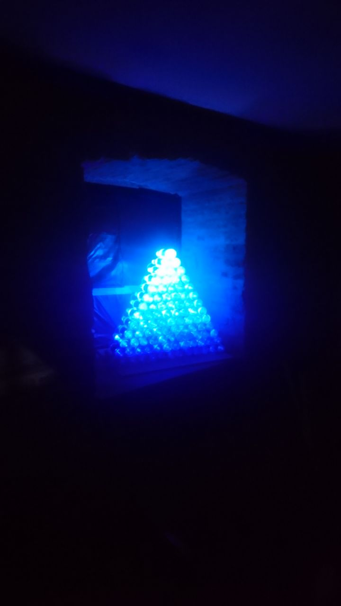

10.0.24.12, accessible from resident wifi network



Worked on [WLED](https://github.com/Aircoookie/WLED)

Set max leds to 500

Use mapping from [WLED Mapping](https://github.com/Aircoookie/WLED/wiki/Mapping)

Mapping:
```json
{"map":[171,172,173,174,175,176,177,178,179,180,181,182,98,183,184,185,186,187,188,189,190,191,192,193,194,195,196,197,198,199,200,201,202,203,204,205,96,206,97,207,208,209,210,211,212,213,214,215,216,217,218,219,220,221,222,223,224,225,226,227,95,228,94,229,93,230,231,232,233,234,235,236,237,238,239,240,241,242,243,244,245,246,247,248,89,249,90,250,91,251,92,252,253,254,255,256,257,258,259,260,261,262,263,264,265,266,267,268,88,269,87,270,86,271,85,272,84,273,274,275,276,277,278,279,280,281,282,283,284,285,286,287,78,288,79,289,80,290,81,291,82,293,294,295,296,297,298,299,300,301,302,303,304,305,77,306,76,307,75,308,74,309,73,310,72,311,71,312,313,314,315,316,317,318,319,320,321,322,63,323,64,324,65,325,66,326,67,327,68,328,69,329,70,330,331,332,333,334,335,336,337,338,62,339,61,340,60,341,59,342,58,343,57,344,56,345,55,346,54,347,348,349,350,351,352,353,43,354,44,355,45,356,46,357,47,358,48,359,49,360,51,361,52,362,53,363,364,365,366,367,42,368,41,369,40,370,39,371,38,372,37,373,36,374,35,375,34,376,33,377,32,378,379,380,20,381,21,382,22,383,23,384,24,385,25,386,26,387,27,388,28,389,29,390,30,391,5,392,19,393,18,394,17,395,16,396,15,397,14,398,13,399,12,400,11,401,10,402,9,403,8,404,7]}
```

Listen Artnet on 10.0.0.0:

25x13 display, RGB
